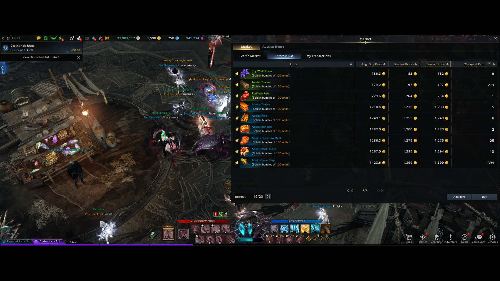

# Lost Ark Market Ocr

## Requirements
```bash
pip install -r requirements.txt 
#or python -m pip install -r requirements.txt
```

## Google Sheets
You need to register your [google cloud app](https://console.cloud.google.com/), enable google sheets api,
and generate oauth2 .json file, put it into root, and rename to `credentials.json`

## Config
- get your google sheets oauth2 `credentials.json` to root of this project
- set tesseract exe location in `read.py`
- Set your Lost Ark 1920x1080, and emulate 21:9,
- Move market to top right corner like on screen:


## Run
```
python read.py
```
And use `print screen` key on your keyboard


